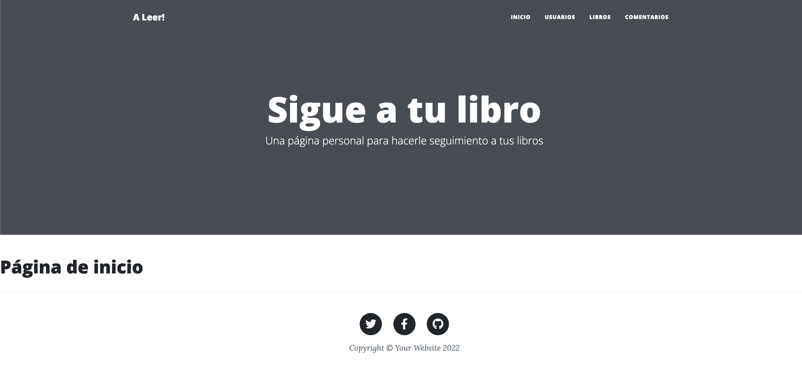

# Entrega1 Aliaga

## Requisitos

- Git
- Python3
- Django

## Configuración

- Clonar el repositorio: `git clone git@github.com:jaliagag/entrega_7_jaliaga.git`
- Entrar en el directorio: `cd entrega_7_jaliaga`
- Agregar la ruta completa del directorio `templates` en el archivo `proyectofinaljaliaga/projectofinal/settings.py`, **línea 58**, del proyecto

```console
# Reemplazar la lína 58 por la ruta hasta nuestro directorio de templates
        'DIRS': ['<RUTA DONDE SE CLONÓ EL REPOSITORIO>/entrega_7_jaliaga/proyectofinaljaliaga/entrega7/template/'],
```

- Levantar el servidor con: `python manage.py runserver`
- Ir al navegador e ingresar en <http://localhost:8000/entrega7/>

Llegados a este punto deberíamos ver algo así:



## Uso

En el menú de arriba a la derecha tenemos 4 botones:

- INICIO: nos lleva a la pantalla de inicio
- USUARIOS: nos permite crear o buscar (por nombre de usuario) USUARIOS
- LIBROS: nos permite crear o buscar (por _autor_) LIBROS
- COMENTARIOS: nos permite crear o buscar (por título del comentario) COMENTARIOS

